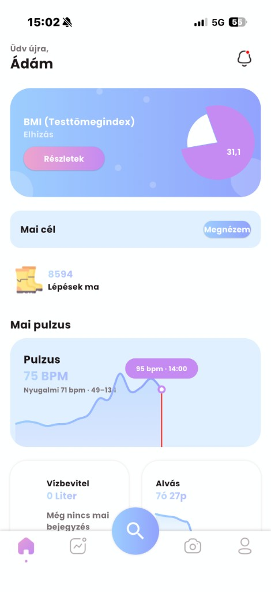
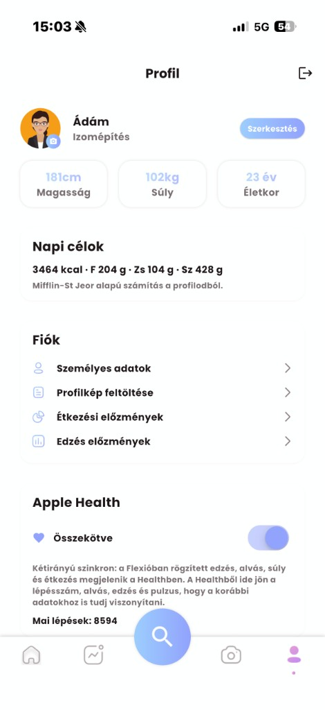
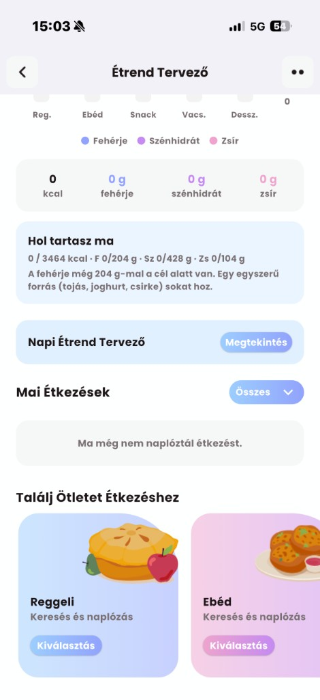
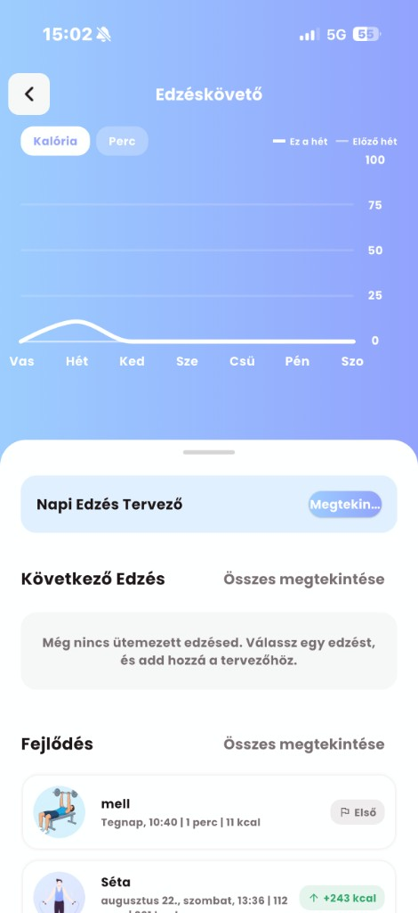
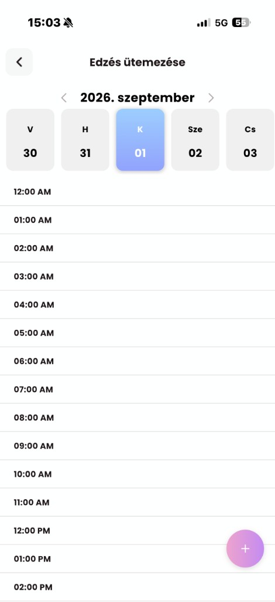
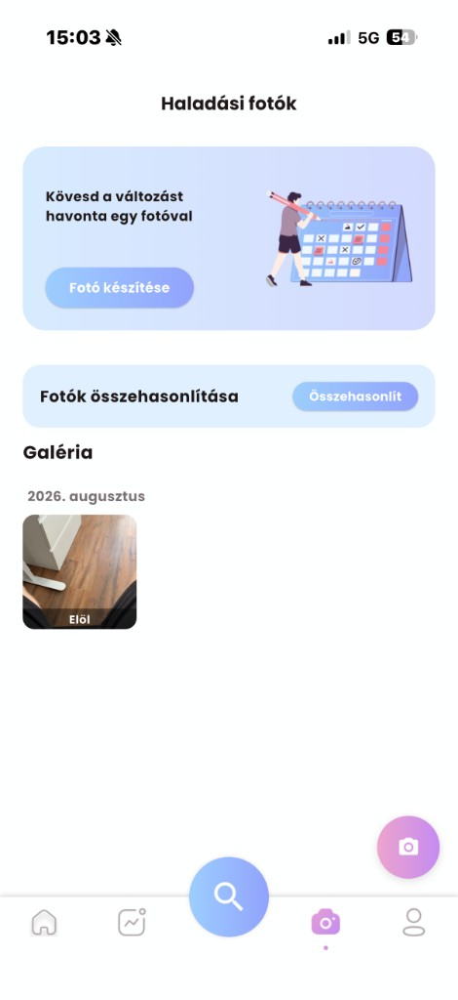
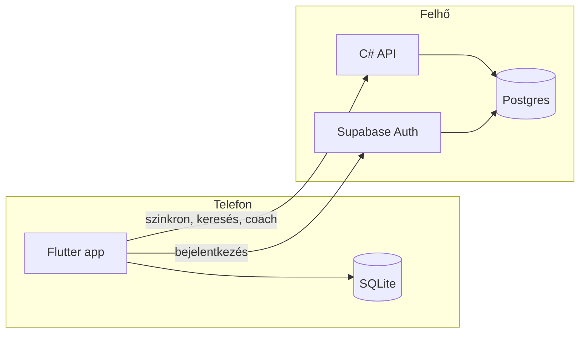

# Flexio

**Magyar nyelvű fitness alkalmazás** — edzés, étkezés, alvás és profil egy helyen.  
Teljes stack portfólióprojekt: **Flutter mobil app** + **Supabase** + **saját .NET API**.

[](https://flutter.dev)
[](https://dotnet.microsoft.com)
[](https://supabase.com)

---

## Röviden

A Flexio egy **mobilalkalmazás** (iOS és Android). Nem weboldal — a felhasználói felület a telefonon fut, a szerver pedig a háttérben szolgálja ki az adatokat.

| | |
|---|---|
| **Mit csinál?** | Edzésnapló, étrendtervezés, alvás követés, profil, Apple Health szinkron |
| **Kinek?** | Magyar nyelvű, mindennapi fitnesz-használatra |
| **Hogyan működik?** | Offline-first: először a telefonra ment, utána szinkronizál a felhőbe |
| **Hol fut?** | App a készüléken · Auth + DB: Supabase · API: Render (Frankfurt) |

---

## Képernyőképek

| Főoldal | Profil | Étrend tervező |
|:---:|:---:|:---:|
|  |  |  |
| BMI, pulzus, lépések, víz, alvás | Napi célok, Apple Health | Makró diagram, napi tippek |

| Ételkeresés | Edzéskövető | Edzés ütemezése |
|:---:|:---:|:---:|
|  |  |  |
| Magyar katalógus, vonalkód | Heti grafikon, előzmények | Naptár, idővonal |

| Haladási fotók |
|:---:|
|  |

---

## Mit implementáltam?

Ez a szekció azt mutatja be, **mit tud a projekt technikailag**.

### Mobil (Flutter)

- **Offline-first adatréteg** — Drift (SQLite); minden művelet először helyben mentődik
- **Állapotkezelés** — Riverpod (session, profil, szinkron, repository-k)
- **Két üzemmód** — teljesen helyi (backend nélkül) vagy felhős (Supabase + API)
- **Bejelentkezés** — Supabase Auth, PKCE, titkosított session tárolás
- **Apple Health** — lépés, alvás, edzés, testsúly kétirányú szinkron (iOS)
- **Magyar tartalom** — ~500 étel, gyakorlat-katalógus, teljes UI lokalizáció

### Backend (.NET 10)

- **REST API** — szinkron, ételkeresés, AI coach, belső jobok
- **JWT hitelesítés** — Supabase token ellenőrzés (JWKS)
- **Postgres** — Npgsql + Dapper, külön DB role-ok (API vs. batch job)
- **Row Level Security** — felhasználónként izolált adat Supabase-ben
- **Docker + Render** — éles deploy, heti cron (Open Food Facts import)
- **Tesztek** — xUnit, integration tesztek Testcontainers-szel

### Amit külön kiemelnék

1. **Szinkron logika** — push → pull, last-write-wins konfliktuskezelés; a profil merge nem írja felül a helyi adatot üres szerver-válasszal
2. **Gateway minta** — a Flutter app ugyanazt a repository réteget használja, akár közvetlen Supabase, akár saját API mögött
3. **Valódi adat, nem mock** — grafikonok, célok, keresés mind élő adatból jön

---

## Funkciók

| Modul | Leírás |
|-------|--------|
| **Főoldal** | BMI, pulzus, lépések, víz, alvás, heti edzésgrafikon |
| **Edzés** | Tervező, ütemezés, magyar gyakorlat-katalógus, statisztikák |
| **Étkezés** | Keresés, vonalkód, naplózás, makró diagramok, napi tippek |
| **Alvás** | Napló, ütemezés, emlékeztetők |
| **Profil** | Testsúly, magasság, életkor, Mifflin-St Jeor alapú napi célok |
| **Haladásfotók** | Havi fotók, összehasonlítás |
| **AI Coach** | Magyar tippek (Gemini API, opcionális) |
| **Értesítések** | Helyi push — edzés, alvás, étkezés |

---

## Architektúra



**Adatfolyam egyszerűen:**

1. A felhasználó rögzít valamit → **először a telefon adatbázisába** kerül.
2. Ha van internet és be van jelentkezve → a **SyncService** feltölti a szervert, majd lehúzza a friss adatot.
3. Ha két eszköz egyszerre módosít → **a későbbi időbélyegű verzió nyer** (last-write-wins).

---

## Technológiai stack

| Réteg | Eszközök |
|-------|----------|
| **Mobil** | Flutter, Riverpod, Drift, Dio, fl_chart, HealthKit |
| **Auth + DB** | Supabase (Auth, Postgres, RLS) |
| **API** | ASP.NET Core, JWT Bearer, Npgsql, Dapper |
| **Deploy** | Docker, Render |
| **Teszt** | flutter_test, xUnit, Testcontainers |

---

## Projekt struktúra

```
Flexio/
├── lib/                    # Flutter app (UI + adatréteg)
│   ├── data/               # Modellek, repository-k, sync, gateway
│   └── view/               # Képernyők
├── assets/                 # Magyar étel- és gyakorlat-katalógus
├── supabase/migrations/    # SQL séma, RLS, keresés
├── backend/                # C# API
│   ├── src/Flexio.Api/
│   ├── src/Flexio.Infrastructure/
│   └── tests/
├── docs/screenshots/       # App képernyőképek
└── scripts/                # Supabase setup, build segédletek
```

---

## Hogyan futtatható lokálisan?

### Előfeltételek

- Flutter SDK ≥ 3.4
- .NET SDK 10.x (backendhez)
- Xcode (iOS) vagy Android Studio (Android)

### 1. Klónozás

```bash
git clone https://github.com/bogszibarack/Flexio-2.0.git
cd Flexio-2.0
flutter pub get
```

### 2. Offline mód (legegyszerűbb — backend nélkül)

```bash
flutter run
```

Minden adat a készüléken marad. A magyar étel- és gyakorlat-katalógus működik.

### 3. Felhős mód (Supabase)

Saját Supabase projekt kell. A kulcsokat **ne** commitold.

```bash
flutter run \
  --dart-define=SUPABASE_URL=https://<project-ref>.supabase.co \
  --dart-define=SUPABASE_PUBLISHABLE_KEY=<publishable-key>
```

Supabase migráció: `./scripts/setup_supabase.sh` (részletek: `.env.supabase.example`)

### 4. Teljes mód (Supabase + saját API)

```bash
flutter run \
  --dart-define=SUPABASE_URL=https://<project-ref>.supabase.co \
  --dart-define=SUPABASE_PUBLISHABLE_KEY=<publishable-key> \
  --dart-define=API_BASE_URL=https://<saját-api-url>
```

VS Code: `.vscode/launch.json` — előre beállított run konfigurációk.

---

## Backend API

A szerver **nem weboldal**. A Flutter app hívja JWT tokennel — böngészőből nem használható demóként.

| Végpont | Mit csinál |
|---------|------------|
| `POST /api/v1/sync` | Profil, napló, edzés, alvás szinkron |
| `GET /api/v1/foods/search` | Magyar ételkeresés |
| `GET /api/v1/foods/barcode/{code}` | Vonalkód alapú keresés |
| `POST /api/v1/coach` | AI coach válasz |
| `GET /api/v1/me` | Bejelentkezett felhasználó |

Helyi futtatás és env változók: [`backend/README.md`](backend/README.md)

---

## Tesztek

```bash
# Flutter
flutter test

# Backend
cd backend && dotnet test
```

A backend integration tesztek lefedik: JWT auth, sync LWW, RLS, belső job végpontok.

---

## Adatforrások

- **Ételek:** saját magyar katalógus + [Open Food Facts](https://world.openfoodfacts.org)
- **Gyakorlatok:** [RepDB](https://repdb.co)
- **UI alap:** [codeforany fitness tutorial](https://www.youtube.com/playlist?list=PLzcRC7PA0xWR1AY-uvplpAYoDFzRdUHgQ) + [Pixel True UI Kit](https://www.pixeltrue.com/free-ui-kits/fitness-app-ui-kit) — jelentős saját fejlesztéssel bővítve

---

## Megjegyzések

- Az egészségügyi és táplálkozási adatok **tájékoztató jellegűek**, nem orvosi tanács.
- iOS telepítés saját eszközre: `flutter build ios --release` + `flutter install` (ingyenes Apple ID-val ~7 napig érvényes).

---

<p align="center">
  <sub>Flexio · portfólióprojekt · Flutter + Supabase + .NET</sub><br/>
  <sub><a href="https://github.com/bogszibarack/Flexio-2.0">github.com/bogszibarack/Flexio-2.0</a></sub>
</p>
