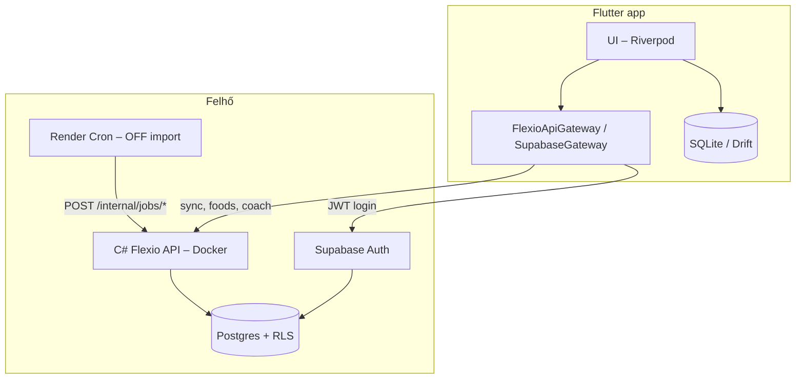

# Flexio

**Magyar fitness app** — edzés, étkezés, alvás, profil és AI coach egy helyen.  
Offline-first Flutter kliens, Supabase Auth + Postgres, saját .NET 10 API a Renderen.

[](https://flutter.dev)
[](https://dotnet.microsoft.com)
[](https://supabase.com)
[](https://render.com)

**Repo:** [github.com/bogszibarack/Flexio-2.0](https://github.com/bogszibarack/Flexio-2.0)  
**Backend állapot:** [health/live](https://flexio-api.onrender.com/health/live) *(csak technikai ellenőrzés, nem demo)*

> A Flexio **mobilalkalmazás** (Flutter), nem weboldal. A böngészőben nem lehet regisztrálni vagy használni — ehhez az appot kell telepíteni (lásd [Próbáld ki](#próbáld-ki)).

<p align="center">
  
  
  
</p>
<p align="center">
  
  
  
</p>
<p align="center">
  
</p>

---

## Tartalom

- [Próbáld ki](#próbáld-ki)
- [Képernyőképek](#képernyőképek)
- [Mi ez?](#mi-ez)
- [Funkciók](#funkciók)
- [Architektúra](#architektúra)
- [Technológiai stack](#technológiai-stack)
- [Projekt struktúra](#projekt-struktúra)
- [Előfeltételek](#előfeltételek)
- [Gyors indulás](#gyors-indulás)
- [Környezeti változók](#környezeti-változók)
- [Supabase beállítás](#supabase-beállítás)
- [Backend (C# API)](#backend-c-api)
- [Render deploy](#render-deploy)
- [Telepítés telefonra](#telepítés-telefonra)
- [TestFlight](#testflight)
- [Tesztek](#tesztek)
- [Eredeti UI forrás](#eredeti-ui-forrás)

---

## Próbáld ki

A Flexio **natív iOS/Android app**. Nincs nyilvános webes demó, ahol bárki regisztrálhatna egy linkre kattintva — ez szándékos: a felület telefonra van tervezve, offline-first működéssel.

| Ki vagy? | Hogyan éred el |
|----------|----------------|
| **Látogató / ismerős** | **TestFlight** (lásd alább) — vagy kérj egy release buildet. |
| **Fejlesztő** | Klónozd a repót, állítsd be a Supabase kulcsokat, futtasd `flutter run`-nal — regisztráció az appban történik. Lépések: [Gyors indulás](#gyors-indulás). |
| **Ops / monitoring** | Backend él-e: [flexio-api.onrender.com/health/live](https://flexio-api.onrender.com/health/live). Ez csak `Healthy` / `Unhealthy` választ ad, nem UI. |

### TestFlight

> **TestFlight link:** *Hamarosan* — az első feltöltés után ide kerül a nyilvános link (`https://testflight.apple.com/join/...`).

Az app **iPhone-ra** telepíthető TestFlight-on keresztül (ingyenes letöltés a tesztelőknek, de a feltöltéshez **Apple Developer Program**, ~99 USD/év kell).

**Feltöltés lépései:** részletes útmutató → [`docs/TESTFLIGHT.md`](docs/TESTFLIGHT.md)

```bash
export SUPABASE_URL="https://<ref>.supabase.co"
export SUPABASE_PUBLISHABLE_KEY="sb_publishable_..."
export API_BASE_URL="https://flexio-api.onrender.com"

chmod +x scripts/ios_testflight.sh
./scripts/ios_testflight.sh
```

Utána App Store Connect → TestFlight → **Public Link** → másold be a linket ide a README-be.

### Miért nem működik a `flexio-api.onrender.com` a böngészőben?

Az URL a **backend API** címe, nem a felhasználói felület. A gyökér (`/`) és az `/api/v1/*` végpontok **JWT tokent** várnak (Supabase bejelentkezés után), ezért böngészőből `401 Unauthorized` a normális válasz — nem hiba.

```
Böngésző  →  flexio-api.onrender.com/        →  401 (védett API)
Böngésző  →  flexio-api.onrender.com/health/live  →  Healthy ✓
Flutter app  →  flexio-api.onrender.com/api/v1/...  →  működik (tokennel)
```

**Jövőbeli nyilvános demo:** TestFlight link a fenti szekcióban, amint feltöltöd az első buildet.

---

## Képernyőképek

| Főoldal | Profil | Étrend tervező |
|:---:|:---:|:---:|
|  |  |  |
| BMI, pulzus, lépések, víz, alvás, heti edzésgrafikon | Napi célok (Mifflin-St Jeor), Apple Health szinkron | Makró diagram, napi tippek, étkezésnapló |

| Ételkeresés | Edzéskövető | Edzés ütemezése |
|:---:|:---:|:---:|
|  |  |  |
| Magyar katalógus, vonalkód, makrók | Heti kalória/perc grafikon, előzmények | Naptár, óránkénti idővonal |

| Haladási fotók |
|:---:|
|  |
| Havi fotók, összehasonlítás, galéria |

Új képernyőképek generálása (opcionális, szimulátor): `bash scripts/capture_screenshots.sh`

---

## Mi ez?

A Flexio egy teljes körű egészség- és fitneszalkalmazás, amely a [codeforany fitness UI kit](https://www.youtube.com/playlist?list=PLzcRC7PA0xWR1AY-uvplpAYoDFzRdUHgQ) alapján készült, de már **valódi adatréteggel, szinkronnal és backenddel**:

- A telefon **offline-first**: SQLite (Drift) tárol mindent helyben.
- A **Supabase** kezeli a bejelentkezést és a Postgres adatbázist (RLS-sel).
- A **saját C# API** (Render, Frankfurt) kezeli a szinkront, ételkeresést, AI coachot és a háttér-jobokat.
- A felület **magyar nyelvű**.

---

## Funkciók

| Modul | Mit tud |
|--------|---------|
| **Edzés** | Edzéstervező, ütemezés, gyakorlat-katalógus (magyar), edzés indítása/befejezése, kalória- és volumen-statisztika |
| **Étkezés** | Magyar ételkatalógus (~500 tétel), keresés, vonalkód, naplózás, makró diagramok (napi/heti/havi) |
| **Alvás** | Alvásnapló, ütemezés, célok |
| **Profil** | Testsúly, magasság, életkor, BMI, napi célok (kcal, makrók, víz) |
| **Főoldal** | BMI, víz, kalória, alvás összesítő — élő adatokból, nem mockból |
| **AI Coach** | Magyar szöveges tippek (Gemini API-n keresztül, opcionális) |
| **Apple Health** | Alvás, edzés, testsúly szinkron (iOS) |
| **Értesítések** | Helyi push: edzés, alvás, emlékeztetők |
| **Haladásfotók** | Fotó napló, összehasonlítás |
| **Szinkron** | Több eszköz között: profil, napló, edzés, alvás (LWW konfliktuskezelés) |

---

## Architektúra



**Adatfolyam (offline-first):**

1. Minden művelet először **helyi DB-be** íródik (`isDirty` jelöléssel).
2. Belépés után a `SyncService` **push → pull** ciklussal szinkronizál.
3. Konfliktusnál **last-write-wins** az `updated_at` alapján.
4. A helyi profil és a szerver üres válasza **egyesítve** marad (nem írja felül a teljes profilt).

---

## Technológiai stack

### Mobil (Flutter)

| Eszköz | Csomag / technológia |
|--------|----------------------|
| Állapot | `flutter_riverpod` |
| Helyi DB | `drift` + SQLite |
| Auth | `supabase_flutter` + PKCE + secure storage |
| HTTP | `dio` |
| Grafikonok | `fl_chart` |
| Vonalkód | `mobile_scanner` |
| Health | `health` (HealthKit) |
| Értesítések | `flutter_local_notifications` |

### Backend (.NET 10)

| Réteg | Technológia |
|-------|-------------|
| API | ASP.NET Core Minimal API |
| Adat | Npgsql + Dapper |
| Auth | JWT Bearer (Supabase JWKS) |
| AI | Google Gemini (opcionális) |
| Deploy | Docker → Render (Frankfurt) |
| Tesztek | xUnit + Testcontainers |

### Adatbázis (Supabase Postgres)

- Row Level Security (RLS) minden user táblán
- Külön DB role-ok: `flexio_api` (RLS alatt), `flexio_jobs` (batch import)
- Magyar ételkatalógus + Open Food Facts import (Magyarország szűrés)
- Full-text + trigram keresés (`search_foods` RPC)

---

## Projekt struktúra

```
Flexio/
├── lib/                      # Flutter app
│   ├── data/                 # Modellek, repo-k, sync, remote gateway
│   ├── view/                 # Képernyők (edzés, étel, alvás, profil…)
│   └── main.dart
├── assets/
│   ├── food_catalog_hu.json  # ~500 kurátorált magyar étel
│   └── exercise_catalog_hu.json
├── supabase/migrations/      # SQL séma, RLS, keresés, role-ok
├── backend/                  # C# API (.NET 10)
│   ├── src/Flexio.Api/
│   ├── src/Flexio.Application/
│   ├── src/Flexio.Domain/
│   ├── src/Flexio.Infrastructure/
│   └── tests/
├── server/scripts/           # build_catalog.mjs (fejlesztői eszköz)
├── scripts/setup_supabase.sh # Migráció + seed egy parancsból
├── render.yaml               # Render blueprint (API + cron)
└── .vscode/launch.json       # Flutter run konfigurációk
```

---

## Előfeltételek

| Eszköz | Verzió |
|--------|--------|
| Flutter SDK | ≥ 3.4 |
| Dart | ≥ 3.4 |
| Xcode | iOS buildhez (macOS) |
| .NET SDK | 10.x (backendhez) |
| Node.js | ≥ 20 (katalógus-buildhez) |
| Supabase projekt | Auth + Postgres |
| Render fiók | API hosting (opcionális) |

---

## Gyors indulás

### 1. Klónozás és függőségek

```bash
git clone https://github.com/bogszibarack/Flexio-2.0.git
cd Flexio-2.0

flutter pub get
cd backend && dotnet restore && cd ..
```

### 2. Helyi / offline mód (backend nélkül)

```bash
flutter run
```

Minden adat a készüléken marad, a beépített magyar étel- és gyakorlat-katalógus működik.

### 3. Supabase mód

```bash
flutter run \
  --dart-define=SUPABASE_URL=https://<project-ref>.supabase.co \
  --dart-define=SUPABASE_PUBLISHABLE_KEY=<publishable-key>
```

### 4. Teljes mód (Supabase + saját API)

```bash
flutter run \
  --dart-define=SUPABASE_URL=https://<project-ref>.supabase.co \
  --dart-define=SUPABASE_PUBLISHABLE_KEY=<publishable-key> \
  --dart-define=API_BASE_URL=https://flexio-api.onrender.com
```

VS Code-ban: **Run and Debug** → válaszd a `.vscode/launch.json` megfelelő konfigurációját.

---

## Környezeti változók

### Flutter (`--dart-define`)

| Változó | Kötelező | Leírás |
|---------|----------|--------|
| `SUPABASE_URL` | Supabase módhoz | Pl. `https://abcdef.supabase.co` |
| `SUPABASE_PUBLISHABLE_KEY` | Supabase módhoz | Publishable key (nem service role!) |
| `API_BASE_URL` | API módhoz | Pl. `https://flexio-api.onrender.com` |

> A titkok **soha** ne kerüljenek a gitbe. A `.env.supabase`, `.env.render`, `backend/.env.local` fájlok gitignore-ban vannak.

### C# API (Render / helyi)

| Változó | Kötelező | Leírás |
|---------|----------|--------|
| `SupabaseAuth__ProjectUrl` | Igen | Supabase projekt URL |
| `Postgres__ApiConnectionString` | Igen | `flexio_api` role connection string |
| `Postgres__JobsConnectionString` | Jobokhoz | `flexio_jobs` role connection string |
| `InternalJobs__SharedSecret` | Jobokhoz | Min. 16 karakter, cron hívásokhoz |
| `Gemini__ApiKey` | Nem | AI coach; üresen fallback szöveg |

Részletes leírás: [`backend/README.md`](backend/README.md)

### Supabase Auth redirect

Add hozzá a Supabase Dashboard → **Authentication → URL Configuration**:

```
com.kokaiadam.flexio://login-callback/
```

---

## Supabase beállítás

```bash
cp .env.supabase.example .env.supabase
# Töltsd ki: SUPABASE_DB_PASSWORD (Dashboard → Database password)

./scripts/setup_supabase.sh
```

A script:

1. Futtatja a `supabase/migrations/` SQL fájlokat
2. Beállítja a `flexio_api` / `flexio_jobs` role jelszavakat
3. Betölti a magyar ételkatalógust (~495 tétel)

---

## Backend (C# API)

```bash
cd backend

# Helyi futtatás (env változókkal)
SupabaseAuth__ProjectUrl=https://<ref>.supabase.co \
Postgres__ApiConnectionString='Host=...;Username=flexio_api.<ref>;...' \
dotnet run --project src/Flexio.Api
```

### Fő végpontok

| Végpont | Leírás |
|---------|--------|
| `GET /health/live` | Liveness probe |
| `GET /health/ready` | Readiness (DB + opcionális Gemini) |
| `POST /api/v1/sync` | Push/pull: profil, napló, edzés, alvás |
| `GET /api/v1/foods/search` | Magyar ételkeresés |
| `GET /api/v1/foods/barcode/{code}` | Vonalkód |
| `POST /api/v1/coach` | AI coach szöveg |
| `POST /internal/jobs/import-off` | OFF import (cron, secret header) |
| `POST /internal/jobs/seed-foods` | Katalógus seed (cron, secret header) |

---

## Render deploy

A [`render.yaml`](render.yaml) két szolgáltatást definiál:

1. **flexio-api** — Docker web service (Frankfurt, free tier)
2. **flexio-off-import** — Heti cron (hétfő 03:00 UTC), curl-lal hívja az API-t

Deploy után állítsd be a Render **Environment** fülön:

- `Postgres__ApiConnectionString`
- `Postgres__JobsConnectionString`
- `InternalJobs__SharedSecret`
- `INTERNAL_JOBS__SHAREDSECRET` (cron service-nél, ugyanaz az érték)

---

## Telepítés telefonra

### iOS — fejlesztői telepítés (saját iPhone)

```bash
# Eszköz ID lekérdezése
flutter devices

# Release build + telepítés
flutter build ios --release \
  --dart-define=SUPABASE_URL=https://<ref>.supabase.co \
  --dart-define=SUPABASE_PUBLISHABLE_KEY=<key> \
  --dart-define=API_BASE_URL=https://flexio-api.onrender.com

flutter install --release -d <device-id>
```

**Bundle ID:** `com.kokaiadam.flexio`  
**Megjegyzés:** Ingyenes Apple ID-val az app ~7 nap után lejár; tartós telepítéshez TestFlight / App Store (fizetős Developer fiók).

### Android

```bash
flutter build apk --release \
  --dart-define=SUPABASE_URL=... \
  --dart-define=SUPABASE_PUBLISHABLE_KEY=... \
  --dart-define=API_BASE_URL=...
```

Az APK: `build/app/outputs/flutter-apk/app-release.apk`

---

## TestFlight

Nyilvános béta iOS-re — ismerősök linkre kattintva letölthetik, regisztrálnak az appban, és kipróbálhatják.

| Lépés | Teendő |
|-------|--------|
| 1 | Apple Developer Program (~99 USD/év) |
| 2 | App Store Connect → új app (`com.kokaiadam.flexio`) |
| 3 | `./scripts/ios_testflight.sh` → IPA feltöltés Transporterrel |
| 4 | TestFlight → External Testing → Public Link |
| 5 | A linket másold be a [Próbáld ki](#próbáld-ki) szekcióba |

Részletes útmutató: [`docs/TESTFLIGHT.md`](docs/TESTFLIGHT.md)

---

```bash
# Flutter
flutter test

# Backend
cd backend && dotnet test
```

Integration tesztek: JWT auth, RLS, sync LWW, belső job végpontok (Testcontainers).

---

## Eredeti UI forrás

Az alkalmazás UI-ja a **codeforany** fitness tutorial sorozatán és a [Pixel True Fitness UI Kit](https://www.pixeltrue.com/free-ui-kits/fitness-app-ui-kit) alapján készült, jelentős funkcionális és architekturális bővítéssel.

---

## Licenc és felelősség

Ez a projekt privát / személyes használatra készült. Az egészségügyi és táplálkozási adatok tájékoztató jellegűek, nem minősülnek orvosi tanácsnak.

---

<p align="center">
  <sub>Flexio · Magyar fitness app · Flutter + Supabase + .NET</sub>
</p>
